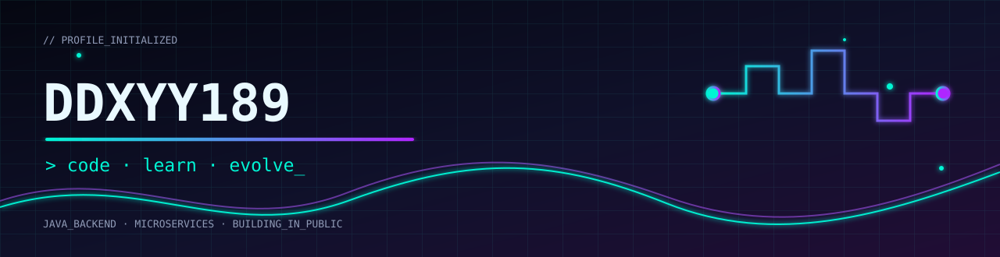

<div align="center">
  
</div>

<div align="center">
  
</div>

<div align="center">
  <a href="https://github.com/DDXYY189"></a>
  
  
</div>

<br />

```text
┌─[ DDXY // SYSTEM.LOG ]────────────────────────────────────────────────────┐
│  身份：一名持续求索的大学生                                                  │
│  方向：Java 后端 · 微服务 · 消息队列 · Web 开发                              │
│  信条：把每一次好奇，变成下一次提交。                                         │
└───────────────────────────────────────────────────────────────────────────┘
```

## 

- 正在夯实 Java 后端与分布式系统基础，也持续探索 AI 与 Web 产品开发。
- 希望把课程项目做成真正可用、可迭代的作品。
- 欢迎交流 Java、微服务、开源项目与大学生开发成长路线。

## 

<div align="center">
  
</div>

<div align="center">
  <br />
  
  
  
  
  
</div>

## 

<div align="center">
  <a href="https://github.com/DDXYY189/AI-daily-report"></a>
  <a href="https://github.com/DDXYY189/group-project"></a>
</div>

## 

<div align="center">
  
</div>

## 

<div align="center">
  
</div>

<div align="center">
  <sub>\[ SIGNAL END \] Thanks for visiting my cyber space.</sub>
</div>
